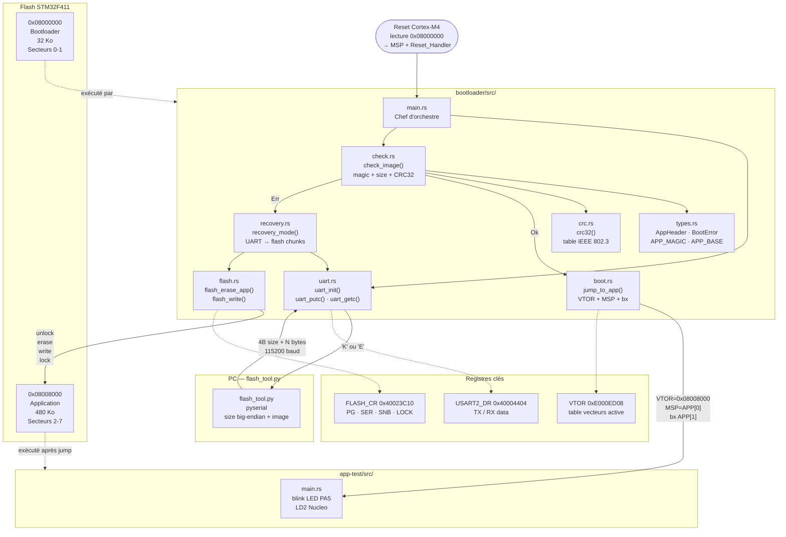

# bootloader-minimal

Bare-metal bootloader for STM32F411 in Rust — CRC32 image verification, flash programming, UART recovery mode. `#![no_std]` · `thumbv7em-none-eabihf`

---

## Architecture

```
02-bootloader-minimal/
├── .cargo/config.toml        ← cible ARM + flags linker
├── Cargo.toml                ← workspace + profile.release
├── flash_tool.py             ← script PC pour envoyer une image via UART
├── bootloader/
│   ├── memory.x              ← FLASH @ 0x08000000 (32K), RAM @ 0x20000000
│   ├── build.rs              ← copie memory.x dans OUT_DIR
│   └── src/
│       ├── main.rs           ← séquence de boot principale
│       ├── lib.rs            ← déclarations modules (testable sur host)
│       ├── types.rs          ← AppHeader, BootError, constantes
│       ├── crc.rs            ← CRC32 table-driven (polynôme IEEE 802.3)
│       ├── check.rs          ← check_image() : magic + taille + CRC32
│       ├── boot.rs           ← jump_to_app() : VTOR + MSP + bx
│       ├── uart.rs           ← USART2 bare-metal 115200 baud
│       ├── flash.rs          ← flash_erase_app() + flash_write()
│       └── recovery.rs       ← recovery_mode() : UART → flash
└── app-test/
    ├── memory.x              ← FLASH @ 0x08008000 (480K)
    ├── build.rs
    └── src/
        └── main.rs           ← blink LED PA5 (LD2 Nucleo)
```

---

## Layout mémoire

```
0x08000000 ┌─────────────────┐
           │   Bootloader    │  32 Ko (secteurs 0-1)
0x08008000 ├─────────────────┤
           │   Application   │  480 Ko (secteurs 2-7)
0x08080000 └─────────────────┘

0x20000000 ┌─────────────────┐
           │      RAM        │  128 Ko (partagée)
0x20020000 └─────────────────┘
```

---

## Séquence de boot

```
Reset
  └─→ uart_init()
  └─→ check_image()
        ├─→ [OK]  : jump_to_app(0x08008000)
        └─→ [Err] : recovery_mode()
                      ├─→ reçoit taille (4 octets big-endian)
                      ├─→ flash_erase_app()
                      ├─→ flash_write() par chunks de 256 octets
                      └─→ répond 'K' ou 'E'
```

---

## Diagramme d'architecture



---

## Structure de l'en-tête applicatif

```
0x08008000  ┌──────────────┐
            │ magic        │  0xDEADBEEF
            ├──────────────┤
            │ version      │  semver encodé
            ├──────────────┤
            │ size         │  taille image (hors header)
            ├──────────────┤
            │ crc32        │  CRC32 IEEE 802.3 de l'image
            ├──────────────┤
            │ entry_point  │  adresse Reset_Handler
            └──────────────┘
```

---

## Build

```bash
# Ajouter la cible ARM (une seule fois)
rustup target add thumbv7em-none-eabihf

# Compiler
cargo build

# Release optimisée taille (< 32 Ko)
cargo build --release
```

## Tests host (sans hardware)

```bash
cd bootloader
cargo test --lib --target x86_64-pc-windows-msvc
```

## Flash sur Nucleo-F411RE

```bash
# Flasher le bootloader
cargo embed --release -p bootloader

# Envoyer l'app-test via UART (recovery mode)
cargo build --release -p app-test
python flash_tool.py COM3 target/thumbv7em-none-eabihf/release/app-test
```

---

## Dépendances

| crate | rôle |
|---|---|
| `cortex-m` | instructions Cortex-M (nop, dsb) |
| `cortex-m-rt` | vecteur de reset, `#[entry]` |
| `panic-halt` | panic handler bare-metal |

---

## Matériel

- **Carte** : STM32F411 Nucleo-F411RE
- **Câble** : USB-A → Mini-USB
- **LED** : LD2 (PA5) intégrée — aucun composant externe requis
- **UART** : PA2 (TX) / PA3 (RX) via ST-Link VCP @ 115200 baud
